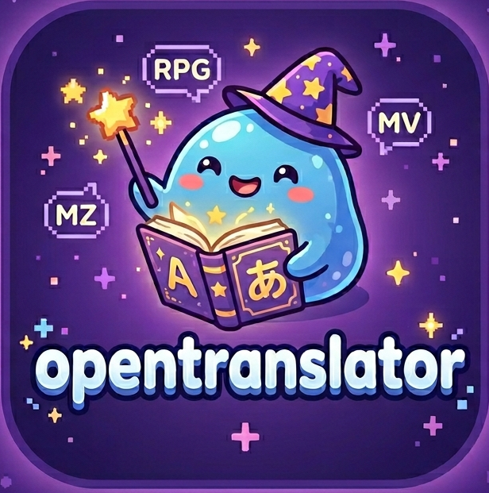

<div align="center">



# OpenTranslator

**Game translation and modding tool — offline-first, no ads, no tracking.**

[](https://github.com/JstEzzo/OpenTranslator)
[](https://nodejs.org/)
[](LICENSE)

</div>

---

## Supported Engines

| Engine | File Translation | Real-Time Hook |
|--------|:----------------:|:--------------:|
| RPG Maker MZ / MV | ✅ | ✅ |
| TyranoScript | ✅ | ✅ |
| Wolf RPG | ✅ | ✅ |
| Ren'Py | ✅ | — |
| Godot Engine | ✅ | — |
| Unity | ✅ | — |
| KRKR / SRPG Studio | — | ✅ |

---

## Quick Start

```bash
git clone https://github.com/JstEzzo/OpenTranslator.git
```

Then double-click **`LAUNCH_OpenTranslator.bat`**.

On first run, the launcher automatically detects and downloads everything that's missing (Node.js, NPM dependencies, engine tools).

---

## How It Works

```
 [LAUNCH_OpenTranslator.bat]
          │
          ▼
 [Backend Server — Node.js :3000]  ←→  [Web UI — Chromium]
          │
          ├── JSON/data file translation (permanent patch)
          ├── Real-time hook via WebSocket :16005
          ├── XOR image/audio decryption
          ├── Smart auto word-wrap
          └── Save and backup management
```

The server listens **exclusively on `127.0.0.1`** — no ports are exposed to the local network or internet.

---

## Translation Engines

- Google Translate
- Bing / Microsoft Translator
- DeepL
- LibreTranslate (self-hosted)
- Local LLM models (via OpenAI-compatible API)

---

## Project Structure

```
OpenTranslator/
├── LAUNCH_OpenTranslator.bat   ← Entry point
└── Tool/
    ├── server.js               ← Main backend
    ├── src/                    ← Server modules
    ├── www/                    ← Web interface
    ├── loaders/                ← Per-engine hooks
    ├── resources/              ← Per-engine tools
    └── gameLib/                ← Engine detection
```

---

<div align="center">
  <sub>Built for players. Translation without the hassle.</sub>
</div>
